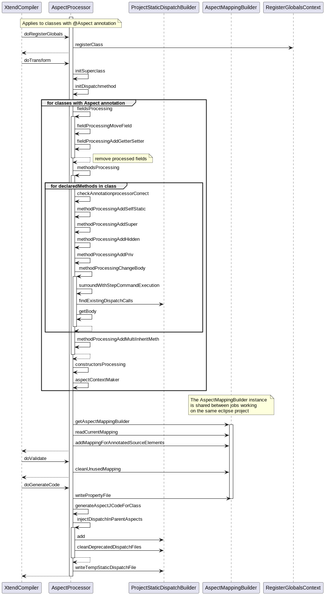
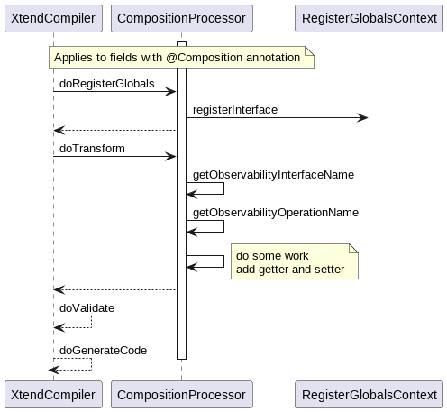
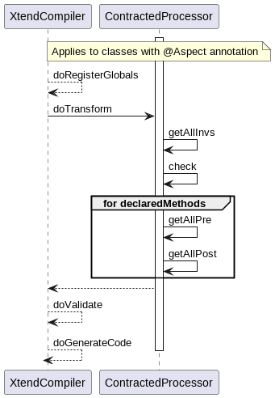

# K3 Annotations processor API and specification 
## List of Processors
* AspectProcessor
* CompositionProcessor
* CompositionProcessor
* ContractedProcessor
* OppositeProcessor
* SingletonProcessor

## Internal behavior of processors 

### AspectProcessor
 

### CompositionProcessor

### ContractedProcessor

### CompositionProcessor

### OppositeProcessor

### SingletonProcessor
